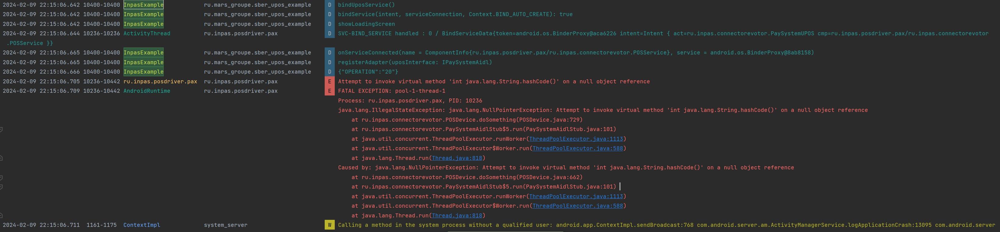

### Пин-пад - S300. На операцию пин-пад никак не среагировал
### Драйвер падает с ошибкой
```
Attempt to invoke virtual method 'int java.lang.String.hashCode()' on a null object reference
```

### Лог
```
2024-02-09 22:13:17.640  1161-1205  DisplayPowerState       system_server                        D  Screen ready
2024-02-09 22:13:17.642  9628-9628  InpasExample            ru.mars_groupe.sber_upos_example     D  onServiceConnected(name = ComponentInfo{ru.inpas.posdriver.pax/ru.inpas.connectorevotor.POSService}, service = android.os.BinderProxy@7b31396)
2024-02-09 22:13:17.643  9628-9628  InpasExample            ru.mars_groupe.sber_upos_example     D  registerAdapter(uposInterface: IPaySystemAidl)
2024-02-09 22:13:17.645   195-352   BufferQueueProducer     surfaceflinger                       I  [ru.mars_groupe.sber_upos_example/ru.mars_groupe.sber_upos_example.MainActivity](this:0xb3fc4800,id:388,api:1,p:9628,c:195) new GraphicBuffer needed
2024-02-09 22:13:17.645   195-352   [MALI][Gralloc]         surfaceflinger                       I  usage: 0xf02, format: 1 stride: 1024 vertical_stride: 600 size: 2457600
2024-02-09 22:13:17.647   195-352   GraphicBuffer           surfaceflinger                       D  alloc, handle(0xb615cea0) (w:1024 h:600 s:1024 f:0x1 u:0x000f02) err(0)
2024-02-09 22:13:17.647  9628-9628  InpasExample            ru.mars_groupe.sber_upos_example     D  {"OPERATION":"20"}
2024-02-09 22:13:17.651  9628-9649  GraphicBuffer           ru.mars_groupe.sber_upos_example     D  register, handle(0xaf804460) (w:1024 h:600 s:1024 f:0x1 u:0x000f02)
2024-02-09 22:13:17.658  1161-1205  DisplayPowerState       system_server                        D  setScreenBrightness: brightness=27
2024-02-09 22:13:17.658  1161-1205  DisplayPowerState       system_server                        D  Requesting new screen state: state=ON, backlight=27
2024-02-09 22:13:17.658  1161-1205  DisplayPowerState       system_server                        D  Screen not ready
2024-02-09 22:13:17.658  1161-1338  DisplayPowerState       system_server                        D  Updating screen state: state=ON, backlight=27, backlightChanged=true
2024-02-09 22:13:17.658  1161-1338  DisplayManagerService   system_server                        D  Update global display state for DisplayDeviceInfo{"Встроенный экран": uniqueId="local:0", 600 x 1024, modeId 1, defaultModeId 1, supportedModes [{id=1, width=600, height=1024, fps=48.23}], density 240, 240.0 x 240.0 dpi, appVsyncOff 0, presDeadline 21733983, touch INTERNAL, rotation 0, type BUILT_IN, state ON, FLAG_DEFAULT_DISPLAY, FLAG_ROTATES_WITH_CONTENT, FLAG_SECURE, FLAG_SUPPORTS_PROTECTED_BUFFERS}
2024-02-09 22:13:17.658  1161-1338  LocalDisplayAdapter     system_server                        D  setDisplayBrightness(id=0, brightness=27)
2024-02-09 22:13:17.659  1161-1338  lights                  system_server                        D  write_int open fd=180
2024-02-09 22:13:17.660  1161-1205  DisplayPowerState       system_server                        D  Screen ready
2024-02-09 22:13:17.679  7607-7614  System                  ru.inpas.posdriver.pax               I  FinalizerDaemon: finalize objects = 1307
2024-02-09 22:13:17.681  1161-1205  DisplayPowerState       system_server                        D  setScreenBrightness: brightness=31
2024-02-09 22:13:17.681  1161-1205  DisplayPowerState       system_server                        D  Requesting new screen state: state=ON, backlight=31
2024-02-09 22:13:17.681  1161-1205  DisplayPowerState       system_server                        D  Screen not ready
2024-02-09 22:13:17.682  1161-1338  DisplayPowerState       system_server                        D  Updating screen state: state=ON, backlight=31, backlightChanged=true
2024-02-09 22:13:17.682  1161-1338  DisplayManagerService   system_server                        D  Update global display state for DisplayDeviceInfo{"Встроенный экран": uniqueId="local:0", 600 x 1024, modeId 1, defaultModeId 1, supportedModes [{id=1, width=600, height=1024, fps=48.23}], density 240, 240.0 x 240.0 dpi, appVsyncOff 0, presDeadline 21733983, touch INTERNAL, rotation 0, type BUILT_IN, state ON, FLAG_DEFAULT_DISPLAY, FLAG_ROTATES_WITH_CONTENT, FLAG_SECURE, FLAG_SUPPORTS_PROTECTED_BUFFERS}
2024-02-09 22:13:17.682  1161-1338  LocalDisplayAdapter     system_server                        D  setDisplayBrightness(id=0, brightness=31)
2024-02-09 22:13:17.682  1161-1338  lights                  system_server                        D  write_int open fd=176
2024-02-09 22:13:17.683  1161-1205  DisplayPowerState       system_server                        D  Screen ready
--------- beginning of crash
2024-02-09 22:13:17.690  7607-9757  ru.inpas.posdriver.pax  ru.inpas.posdriver.pax               E  Attempt to invoke virtual method 'int java.lang.String.hashCode()' on a null object reference
2024-02-09 22:13:17.693  7607-9757  AndroidRuntime          ru.inpas.posdriver.pax               E  FATAL EXCEPTION: pool-1-thread-1
                                                                                                    Process: ru.inpas.posdriver.pax, PID: 7607
                                                                                                    java.lang.IllegalStateException: java.lang.NullPointerException: Attempt to invoke virtual method 'int java.lang.String.hashCode()' on a null object reference
                                                                                                    	at ru.inpas.connectorevotor.POSDevice.doSomething(POSDevice.java:729)
                                                                                                    	at ru.inpas.connectorevotor.PaySystemAidlStub$5.run(PaySystemAidlStub.java:101)
                                                                                                    	at java.util.concurrent.ThreadPoolExecutor.runWorker(ThreadPoolExecutor.java:1113)
                                                                                                    	at java.util.concurrent.ThreadPoolExecutor$Worker.run(ThreadPoolExecutor.java:588)
                                                                                                    	at java.lang.Thread.run(Thread.java:818)
                                                                                                    Caused by: java.lang.NullPointerException: Attempt to invoke virtual method 'int java.lang.String.hashCode()' on a null object reference
                                                                                                    	at ru.inpas.connectorevotor.POSDevice.doSomething(POSDevice.java:662)
                                                                                                    	at ru.inpas.connectorevotor.PaySystemAidlStub$5.run(PaySystemAidlStub.java:101) 
                                                                                                    	at java.util.concurrent.ThreadPoolExecutor.runWorker(ThreadPoolExecutor.java:1113) 
                                                                                                    	at java.util.concurrent.ThreadPoolExecutor$Worker.run(ThreadPoolExecutor.java:588) 
                                                                                                    	at java.lang.Thread.run(Thread.java:818) 
2024-02-09 22:13:17.695  1161-2213  ContextImpl             system_server                        W  Calling a method in the system process without a qualified user: android.app.ContextImpl.sendBroadcast:768 com.android.server.am.ActivityManagerService.logApplicationCrash:13095 com.android.server.am.ActivityManagerService.handleApplicationCrashInner:13068 com.android.server.am.ActivityManagerService.handleApplicationCrash:13052 android.app.ActivityManagerNative.onTransact:1478
2024-02-09 22:13:17.696  1161-2213  ActivityManager         system_server                        V  Broadcast: Intent { act=ru.evotor.monitoring.event.EventReporter.reportEvent flg=0x10 (has extras) } ordered=false userid=0 callerApp=ProcessRecord{71de774 1161:system/1000}
2024-02-09 22:13:17.696  1161-2213  SettingsInterface       system_server                        D   from settings cache , name = dropbox:data_app_crash , value = null
2024-02-09 22:13:17.697  1161-2213  SettingsInterface       system_server                        D   from settings cache , name = send_action_app_error , value = null
2024-02-09 22:13:17.697  3584-3584  ContextImpl             ru.evotor.systemlogger               W  Calling a method in the system process without a qualified user: android.app.ContextImpl.startService:1226 android.content.ContextWrapper.startService:581 ru.evotor.systemlogger.receivers.EventReceiver.onReceive:6 android.app.LoadedApk$ReceiverDispatcher$Args.run:922 android.os.Handler.handleCallback:815
```